# LIBROTEKA 📚

Proyecto completo desarrollado con Django, enfocado en la gestión visual e interactiva de libros. Ofrece autenticación, carga de libros en PDF, calificación, recomendaciones por género y visualización de datos mediante gráficos 📊.

---

## 🛠 Instalación del Proyecto

```bash
git clone https://github.com/Edgarchooo/LIBROTEKA.git
cd LIBROTEKA
python -m venv env
env\Scripts\activate
pip install -r requirements.txt
python manage.py migrate
python manage.py createsuperuser
python manage.py runserver
```

---

## 🔐 Autenticación y Registro de Usuario

| Acción | Captura |
|-------|---------|
| Home sin autenticar |  |
| Formulario de login | 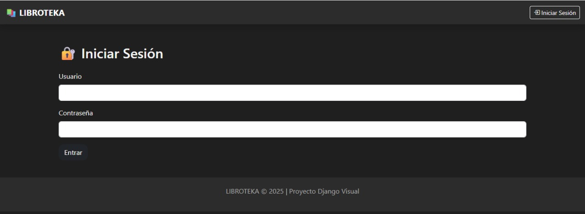 |
| Home autenticado | 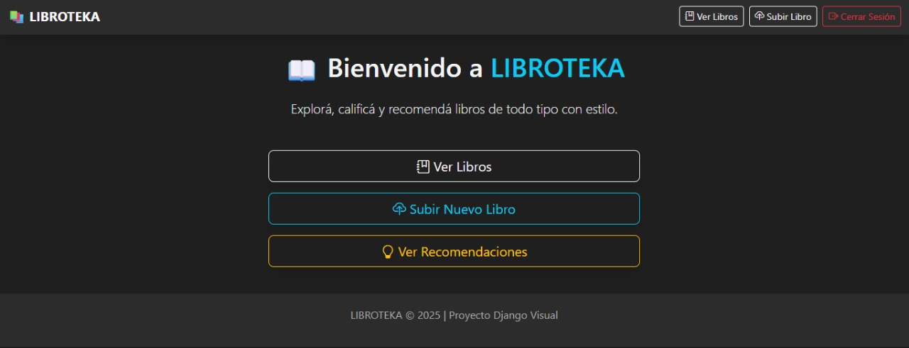 |

---

## 📥 Subida y Edición de Libros

| Acción | Captura |
|-------|---------|
| Subir nuevo libro | 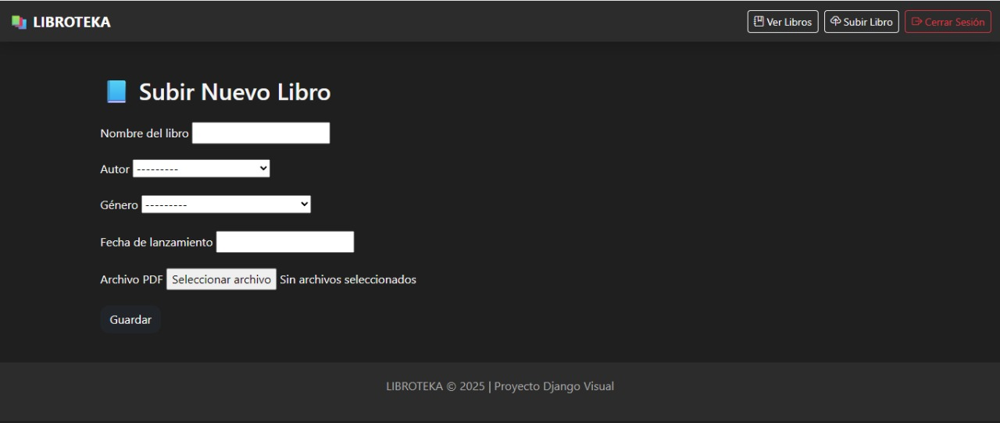 |
| Confirmación de libro subido | 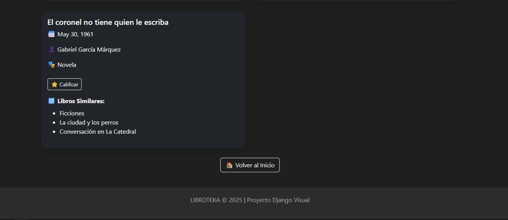 |
| Edición desde admin | 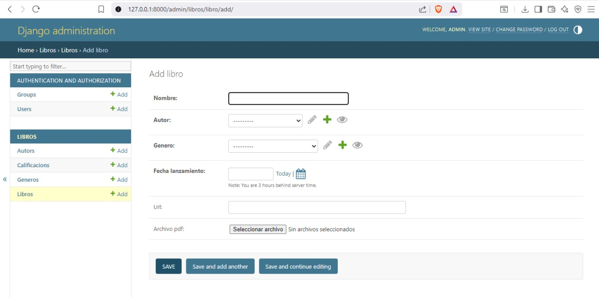 |

---

## 🌟 Calificaciones

| Acción | Captura |
|-------|---------|
| Formulario para calificar libro | 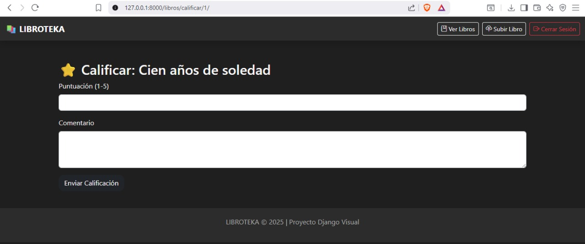 |
| Promedio por género | 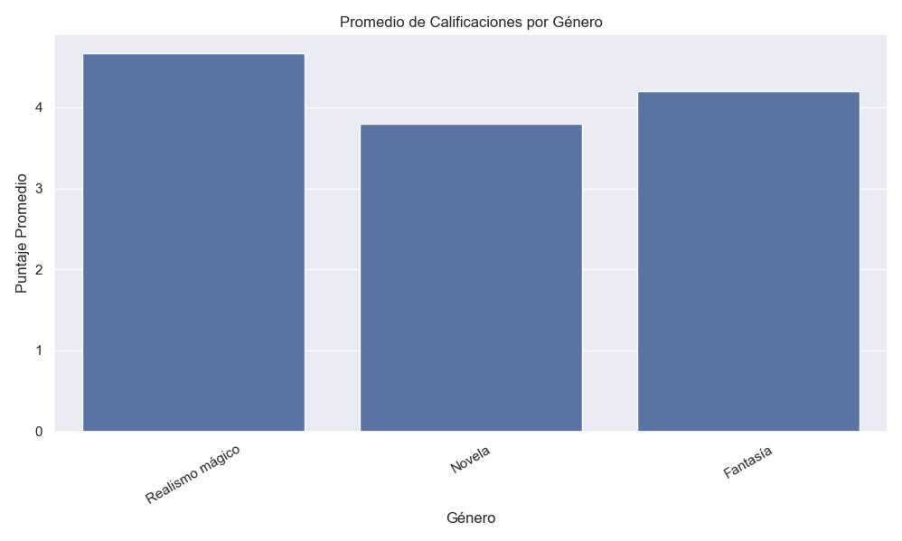 |
| Promedio por autor | 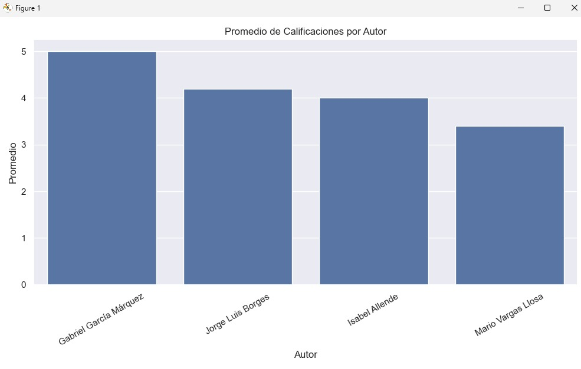 |
| Distribución de calificaciones | 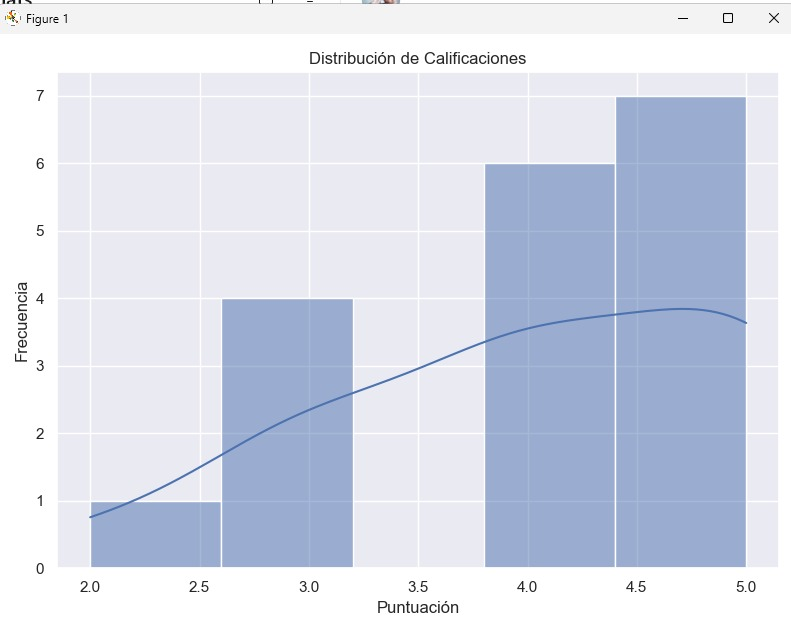 |

---

## 🧠 Recomendaciones por Género

| Acción | Captura |
|-------|---------|
| Vista inicial | 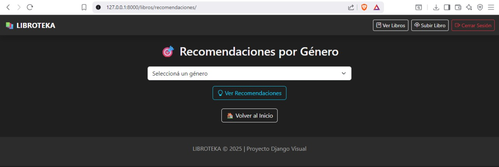 |
| Resultados | 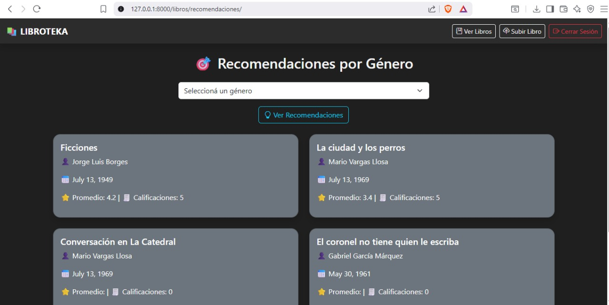 |

---

## 📋 Visualización y API

| Acción | Captura |
|-------|---------|
| Ver libros web |  |
| Ver libros en Postman | 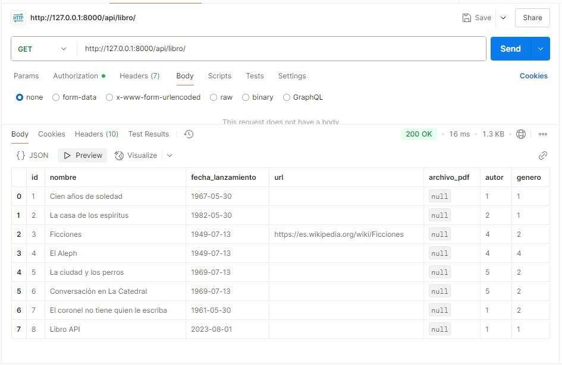 |
| Crear libro en Postman |  |
| Token login Postman | 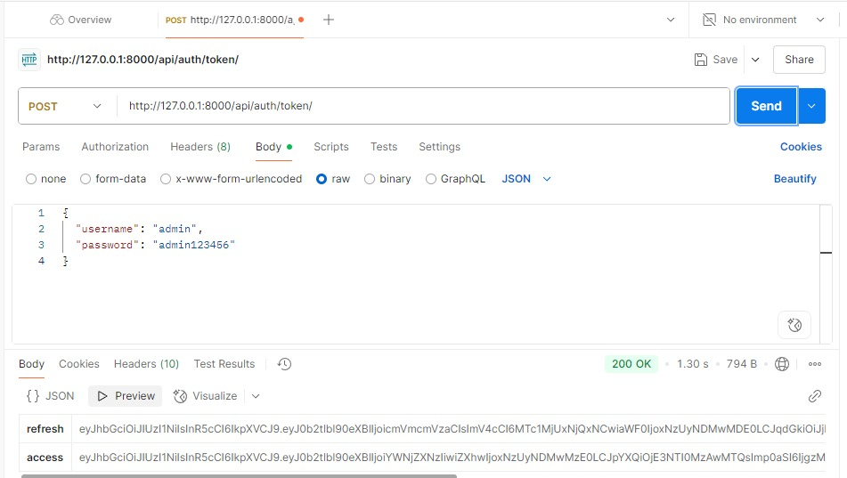 |
| Libro no encontrado | 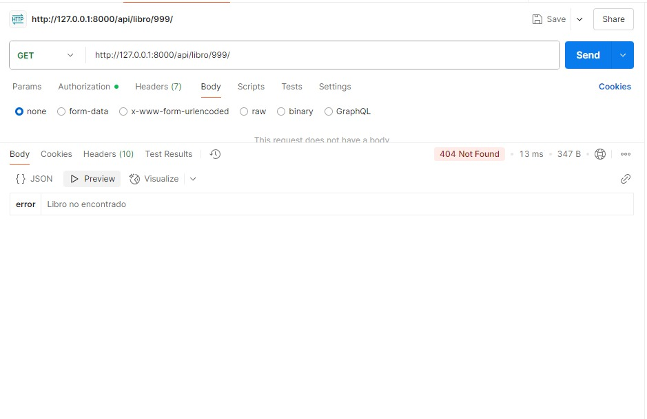 |

---

## 🔧 Panel de Administración

| Acción | Captura |
|-------|---------|
| Modelos visibles | 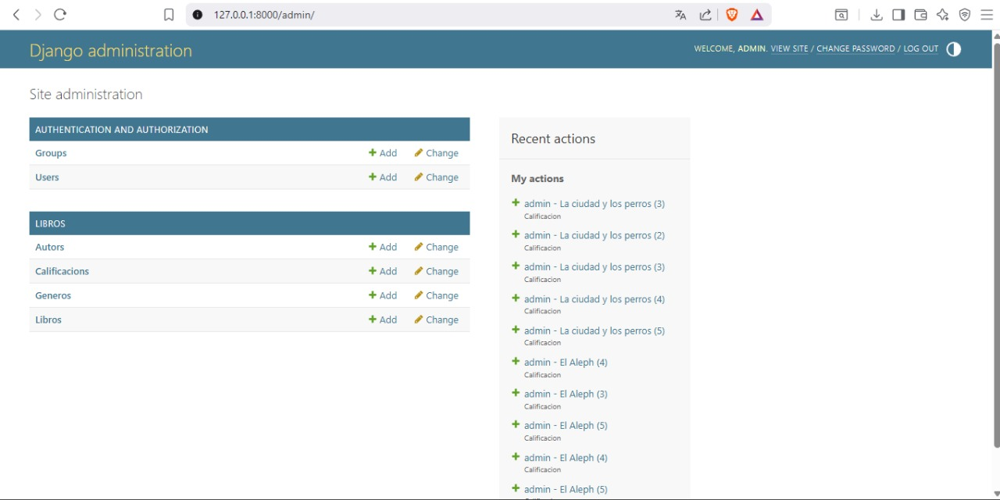 |

---

© 2025 LIBROTEKA - Proyecto Django Visual
